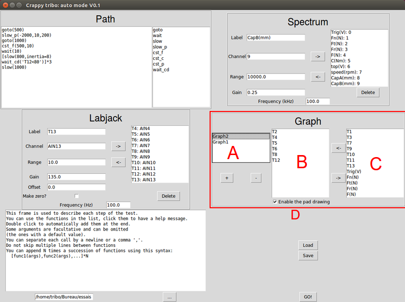

Content
-------

* [Main page](help.md)
* [Hardware description](hardware.md)
* Auto mode interface (this page)
* [Auto mode code description](auto.md)
* [Tools description](tools.md)

Using the interface
===================
It is divided in 4 sections: Path, Labjack, Spectrum and Graph. There is a help
section on the bottom-left hand corner, and load/save buttons to manage
configurations.

When the user clicks "GO", this window disappears, only leaving a pop-up that
allows to interrupt the test and states the current step, and the graphs
asked in the "Graph" frame. It will create a folder named like so
"Day_Month_dd_hh:mm:ss" in the chosen folder (default is "Bureau/essais").
This folder will contain 4 files:

* config.p: The configuration of the test, to reload the program if necessary
* lj1.csv: The data read by the first Labjack
* lj2.csv: The data read by the second Labjack (if at least one channel is
  opened)
* spectrum.hdf: The data read from the Spectrum (if at least one channel is
  opened)

Path
----

This frame defines the steps of the test. Each step can be added by calling
a function. The test will be entirely defined by the content of (A).
Available functions are shown on the list on the right of the frame (B).
Clicking a function will print the associated help on the help frame (C),
double-clicking it will automatically add it at the end of the textbox (A).

When starting the test, the text in (A) will be parsed as so:

* Leading and trailing newline/spaces are removed
* Newlines are replaced by commas
* The text is surrounded by brackets [...]
* It is evaluated as Python expression and assigned to a variable
    * If the syntax was correct, this variable is a list
* The inner lists are "flattened": each elements of a sublist are inserted
  as individual elements of the list.

The last step is meant to simplify looping over multiple steps. For example
you can write:

    [goto(1000),slow(800)]*2

It will be expanded as goto(500), slow(200), goto(500), slow(200)

Note that since newlines are replaced by commas, you can also write

    [goto(1000)
    slow(800)]*2

Here is an example of a correct code:

    goto(500)
    slow_p(-2000,10,200)
    goto(1000)
    cst_f(500,10)
    wait(10)
    [slow(800,inertia=8)
    wait_cd('T12<80')]*3
    slow(1000)

Some arguments are optional: For example slow(force,inertia=5,speed=0)
can be used with only the force slow(800). Inertia and final speed will
be the default values (5 and 0). You can also explicitly name the arguments:
slow(force=1000,speed=300). In that case, the order does not matter. You
must make sure to give all the arguments that do not have a default value.
When inserting a function by double-clicking, make sure to remove all
the chevrons as they will raise a syntax error. They are just here to
illustrate the place of the arguments.

At the end of the path, will automatically be added an "end" step, which
pushes the hydraulic actuator out, stops the main motor and sets the pad
to its initial position. This is to make sure that the bench gets back to its
initial position at the end of the test.

The acquisition on specified channels (see Labjack and Spectrum section)
will automatically start at the beginning of the test, when clicking "GO" and
stop when the end of the path is reached. If you want to continue the
acquisition after the test, you can use wait(<delay>) or wait_cd("condition").
The windows will close and the program will end when the end of the path
is reached.

### List of the functions
#### goto(speed,delay=5)
Will accelerate/slow down the axle to the given speed.
Once the speed is within 5% of the given value, this function
will wait delay seconds to allow the speed to stabilize.
The hydraulic actuator will be out during this phase and the pad force/position
will be set to the value of the next step, or default position if the next
step is not a breaking.

#### wait(delay)
To manually wait for a given delay (in seconds). During this step the hydraulic
actuator is out and the pad is eventually preparing for the next step.

#### slow(force,inertia=5,speed=0)
This will initiate a breaking with inertia simulation and the pad force will
be driven by the PID on the main Labjack to be the given force (in N).
The main motor speed will be refreshed by the program itself, based
on the torque measurement and the value of the simulated inertia (in Nm²).
This step will end when the speed reaches the given
argument in rpm (default is 0, so a complete stop).

#### slow_p(pos,inertia=5,speed=0)
This step is just like slow, except that the pad motor will stay completely
still. Instead of giving the force, simply give the pad position (in µm).
To know what position approximately corresponds to a force, you can use the
manual mode (see [Tools description](tools.md)), set a force with the PID
and read the associated position.
Beware that positive values move away from the disc and negative values get
closer.

#### cst_f(force,delay)
This function will apply the given force (again, using the PID on the Labjack)
but there will be no inertia simulation: speed will remain constant during
this step. It will stop after delay seconds.

#### cst_p(pos,delay)
cst_p is to cst_f what slow_p is to slow: it will do the same thing as cst_f
but instead of driving the force with the PID, the pad motor will stay
at the same position.

#### cst_t(torque,delay)
cst_t tries to drive the torque (in Nm) instead of the force. The input of the
PID is now the reading of the torque-meter. The pad motor will be driven in
order to keep the torque constant. The speed will stay constant during this
phase. It is meant to run tests at a constant power. Make sure that the motor
will be turning before this step, or the pad force will increase continuously.
This step will stop after delay second.

#### wait_cd(string)
This step waits for a condition to be reached. It is a Crappy-style
condition, see crappy.blocks.Generator doc for more details.
Syntax can be "mylabel>val" or "mylabel<val", where mylabel is the name of
a channel created in the other frames. **Do not forget the quotation marks**,
val must be a numerical value and cannot be another label.

#### Adding a function
All these functions are defined in auto/funcs.py, see
[Auto mode code description](auto.md) for more info on the code and learn
how to add another type of step in the program.

Spectrum
--------

This frame is used to configure the channels to be acquired by the Spectrum
PCI card. To add a channel, simply fill the fields (A) and click the
right arrow. It will add an entry to the list (B).

You can delete a channel by selecting it (by clicking on it) and pressing
"Delete". To edit a channel, click the left arrow to remove it from the list
and fill the fields with the previous values. You can edit them and click
the right arrow to add it again.

The order of the channel has no impact, therefore there is no convenient
way to modify it once the channels were created.

### Label field
It holds the name you want to give to this channel.
It is advised to be explicit, and specify the unit. The labels must all
be unique, even across Spectrum and Labjack channels. This field is mandatory.

### Channel field
It must be an int, between 0 and 15 included, each of them corresponding to
a channel of the spectrum card. Obviously, there cannot be any duplicate.
This field is mandatory.

### Range field
To specify the range of the acquisition to configure the Spectrum channels.
This card supports (+/-50mV, 100mV, 250mV, 500mV, 1V, 2V, 5V and 10V).
The range is always symmetrical and must be given in mV. Not providing
the range or giving an invalid value will result in the default value: 10000.

### Gain field
You can also specify a gain to convert the channel readings in V to the
physical unit. This will **not** have any impact on the saved data itself, as
it is stored as int16. They will only be applied to real-time plots and
saved as a meta data in the hdf file. If it is not specified, it will be
set to 1. See below for more info on the hdf file and how to process it.

The Spectrum can only open 0,1,2,4 or 8 channels per module
(channels 0-7 and 8-15) and if both modules are used, they must have the same
number of open channels. The program takes care of opening extra channels
when the selected channels do not comply with these conditions.
This may make your HDF files heavier than expected.

You can enter the desired frequency of the acquisition in kHz. The max value
is 100kHz and the card will try to be as close as possible to the desired
value. The actual value will be written as a meta data of the hdf5 file.

Labjack
-------
This frame is used to configure the **second** Labjack
(the one linked by Ethernet)
and used for acquisition only. The main Labjack cannot be configured with the
GUI but by editing a file, see [Auto mode code description](auto.md)
for more information.

Just like the Spectrum frame, it is used to configure the channels of the
Labjack. The label is a name to identify the channel. You cannot use the same
name as a channel from the spectrum: each label must be unique.

### Label field
It holds the name you want to give to this channel.
It is advised to be explicit, and specify the unit. The labels must all
be unique, even across Spectrum and Labjack channels. This field is mandatory.

### Channel field
The channel must be specified according to Labjack naming convention (Ex: AIN0)
There cannot be any duplicate. This field is mandatory.

### Range field
Labjack ranges must be either 10 (default), 1, .1 or .01. It is the range in
Volt (Ex: 1 => +/- 1V)
The range is always symmetrical and must be given in V. Not providing
the range or giving an invalid value will result in the default value: 10.

### Gain field
You can also specify a gain to convert the channel readings in V to the
physical unit.
Note that unlike the Spectrum channels, the gain **will** be applied to the
data using Labjack built-in slope extended feature.

### Offset field
Additionally you can specify an offset. With a the gain, b the offset and
v the value in volt, the returned value will be a*v+b.

### Make zero checkbox
If this box is ticked, the value at the beginning of the program will be read
and added to the given offset.

The data will be saved as lj2.csv and it will try to run at the specified
frequency. However, note that the frequency may vary as the acquisition
is run in "single" mode.

Graph
-----

This frame is used to create graphs that will display data in real time during
the test. You can add a graph by pressing the (+) button, remove one by
selecting it in the list (A) and clicking (-).Each graph will be opened
in a new window. To add a plot to a graph windows, select it in (A),
then select the label you want to plot in C and click the left arrow (<-).
It will add it in (B). Each graph will plot all the data in (B), but note
that the scale will adapt to extrema off all curves, so depending on
the units some curves may be impossible to read. You can either plot them in
another windows or adapt the gain to have closer values.

If (D) is ticked, an extra window will open at he beginning of the test.
It will show the pad with the readings of the thermocouples and a
colorbar to visualize the heat distribution on the pad. This window
cannot be configured with the GUI but it is simple to change its configuration
by editing auto/pad_config.py. For more details, see
[Auto mode code description](auto.md).

Saving/Loading
--------------
All the configuration in this frame can be saved and loaded at will.
It is possible to load/save only chosen frames. When opening the program, it
automatically loads auto/default.p. This file can be edited if it becomes
obsolete, but it is advised to save configurations for your tests without
overwriting the default config. The config is a Pickle file containing all the
information a Python lists and dicts. When loading/saving, you must check the
frames you want to load/save, then the program will ask for a location.
If the loaded file does not have the data to load a selected frame, it will
not be changed and print a message in the help textbox.

The output data
---------------
Before pressing "GO!", make sure you selected the desired output folder
on the bottom left field. The default is /home/tribo/Bureau/essais.

Once the path is over or the "stop" button is pressed, the program *should*
terminate cleanly and all the windows should be closed. Forcing the
closing may result in corrupted data files.

In the output folder, you will find a folder named after the timestamp of
the beginning of the test containing four file:

### config.p
This file is the config of your test. It is exactly the same as if you
used the save button before starting the test. This allows re-opening it
to re launch it or to check the parameters.

### lj1.csv
This is all the data read by the first Labjack as a csv file.
This is not configured with the GUI, but by editing auto/lj1_chan.py.
It is best to keep the default setting for this card as it is
also driving all the actuators.

### lj2.csv
This file holds the data read by the second Labjack (if any channel was added).
This is a csv, the first line holds the labels, then each line holds
the values (after applying gain and offet) separated by commas.

### spectrum.h5
This file is a bit more complicated than a csv. Writing the data from the
spectrum as a csv would create humongous files (more than 4 times as heavy
than hdf5). A hdf5 file can be seen as a tree view: there is a root node,
which holds child nodes. Each node can hold other nodes, or data. Data can
be organized as arrays. Here, there is no complicated hierarchy: we only
have a few nodes at the root, holding informations about the acquisition:

Let us say we opened N channels and read M lines of data

#### channels
An array of ints, dimension = (N)

It holds the index of the opened channels

#### names
An array of strings, dimension = (N)

Stores the names of the channels

#### ranges
Array of ints, dimension = (N)

Stores the ranges of the acquisition for each channel

#### gains
Array of floats, dimension = (N)

Stores the gain for each channel

#### factor
Array of float, dimension = (N)

For each channel, it is the value step physical unit for one DL.
It is range*gain/32000. It is used to convert the data in ints to
its physical value.

#### freq
Single value, int

Stores the frequency of the acquisition

#### table
Array of int16, dimension = (M,N)

The actual data, in digital levels. A DL of 32000 means the maximum value of
the range and the scale is linear. You simply have to multiply each column
to its corresponding value in the table "factor" to convert these to
the chosen unit (provided the gain value is correct) or by range/32000
to convert it to mV.

Note that the order of the channels may be different than the given order:
The order of the columns in the table is specific to the spectrum,
but all the corresponding tables have been organised to match the organisation
of these columns.
